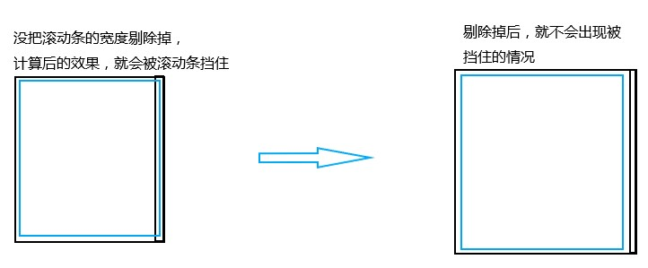
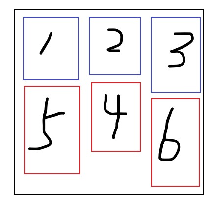

# 存放一些自己编写的插件

> 主要是把自己做过的效果，归纳一下，并写成一个小插件，方便使用。PS:部分插件依赖jquery。

## 模板

* [移动端 vue 模板（基于 vue-cli 进行修改）](#mobileVueTemplate)

## 插件清单

* [瀑布流](#waterfall)
* [全屏滚动](#fullpage)

 ---

## 文档说明

<h3 id='mobileVueTemplate'>移动端 vue 模板</h3>

> 在公司工作了4个月，对移动端的模板进行了修改

模板是基于 vue-cli，然后添加一些统一处理的方案

这些在模板文件的说明文档有了，这里不展开

<h3 id='waterfall'>瀑布流</h3>

> 瀑布流插件，使用简单，调用就可以了。支持IE8。依赖jquery。

[DEMO地址](http://www.rni-l.com/plugins/demo/waterfallsFlow)(PS:点击黑色正方形，会加载更多的图片)

#### 如何使用

	//引入css
	.waterfallsflow {
  		padding: 0 20px;
  		box-sizing: border-box;
  		width: 100%;
  		min-height: 998px; }
  	.waterfallsflow_wrap {
    	position: relative;
    	width: 100%; }
  	.waterfallsflow_list {
   		position: absolute; }
   		.waterfallsflow_list img {
      	width: 100%;
      	display: block; }

	//引入js，jq版本随意
	
	

	//使用
	var _o = new $.Waterfallsflow({
		box:'.waterfallsflow',
		aList:'.waterfallsflow_list',
		//媒体查询，可以根据浏览器当前的宽度，设定特殊的值，一行有多少个，水平间距和垂直间距
		media:{
			1024:{
				levelNum:4,
				mW:15,
				mH:15
			},768:{
				levelNum:2,
				mW:10,
				mH:10
			},480:{
				levelNum:1,
				mW:0,
				mH:10
			}
		}
	})
	_o.init();
	//页面宽度改变，重新布局
	$(window).on('resize',function(){
		_o.resize();
	})
	//如果有新数据加入，传入新数据的长度即可
	_o.update(len);

#### 插件的方法

##### init()

接受一个对象参数，`{}`

	{
		box:'.waterfallsflow',//必填，字符串，瀑布流最外层盒子
		aList:'.waterfallsflow_list',//必填，字符串，瀑布流列表
		levelNum:4,//选填，数字，每行多少个
		mW:15,//选填，数字，水平间距
		mH:15,//选填，数字，垂直间距
		media:{//选填，对象，根据当前浏览器的宽度，进行显示
			1024:{
				levelNum:4,
				mW:15,
				mH:15
			},768:{
				levelNum:2,
				mW:10,
				mH:10
			}
		}
	}

##### resize()

直接调用即可。重新计算位置。当最外层盒子的宽度进行改变时，进行调用。

##### update()

接受一个参数，字符串，新添加数据的长度。调用后，会计算新加入的数据。

#### 原理

> 这里是教程，有兴趣的朋友，可以看下。

##### 布局

布局很简单，我这里是使用**绝对定位**的，或者使用css3的`column`也行，不过它是竖排排序的，不是横排的，这样不大好。所以就使用了绝对定位，绝对定位除了麻烦点外，兼容性好。

瀑布流最外层的盒子，给个相对定位就好了。我在样式那里，最外层盒子是给了个`height:1000px;`的，这样做的原因是，如果图片多了，会超过了一屏的，当计算完毕并赋值后，超过一屏，就会出现滚动条，这样浏览器的宽度也会超出，右边会出现被挡住的现象。如果在计算前手动扣除滚动条的宽度，这样怕会计算不准，因为每个浏览器的滚动条宽度并不相同，所以，在计算前，才把滚动条召唤出来，这样获取的宽度就剔除了滚动条，最后计算的效果会很完美。

##### 如何计算left和top

先上图：

间距和长方形的宽度都是相等的，只不过我画工烂。

这种瀑布流效果，是等宽、等间距，高度自适应的。图片只需要`width:100%;display:block;`就好了。

先看第一排效果：

`top`值是相等的，都是0，然后`left`值都是有规律的，因为都是等宽的，所以只要`listWidth + marginLeft`乘以第几个就好了。而且后面所有的`left`值都是一样的，所有我们可以用一个数组存起来。

	//比如一排有5个，这样就可以计算到一排每个的left值了。
	for(var i=0;i<5;i++){
       arrLeft.push( (_w + _mW) * i);
    }

赋`left`值的时候，只要知道是当前图片是在每排的“第几个位置”就好了。

然后我们看看第二排：

第二排就不同了，我们可以看到第4个图片的位置，不是放在**第二排第一个位置**，而是放在三列中，最矮的那列。这样排的原因是，为了好看！不然最后几排就会惨不忍睹，高低不平的现象会很严重。

大概原理就是这样了，主要是计算`top`值，第一排的，全部给0就好了，然后我们看看第4张图片是如何计算的。

同样我先声明一个数组`arrTop`，用来累积每行每个的高度。

	//这是第一排的，添加第一行每个的高度和高度间距
	for(var i=0;i<5;i++){
       arrTop.push(aList.eq(i).height() + _mH);
    }

这样用数组累积保持数据，方便赋值。计算当前数组最小的值是在第几位置，而第四张图片是在**第二排的第二个位置**，

	//第二排，第二排之后，获取当前arrTop最小数的位置
	var index = getMin(arrTop)

	//这样就完成了
	aList.eq(i).css('top',arrTop[index])

	//添加完值后，arrTop第二个位置的数，要累加当前图片的高度和间距
	arrTop[index] += aList.eq(i).height() + _mH

	//这样只要有图片是排在第二个位置上的，就可以直接赋值了。
	...
	aList.eq(i).css('top',arrTop[index])

`left`和`top`值计算完后，然后就是获取当前瀑布流最高的高度了，赋值给最外层盒子，这样才能撑起来。

##### 图片还没加载完，怎么知道高度呢？

这个是个比较大的问题，不知道图片的高度，是无法做下去的，但没可能`window.onload`之后才执行的，这样效果太差了，当图片比较大的时候，会很卡。

我这里的解决办法是，用一个定时器，检测每张图片的高度，当获取到所有图片的高度后，就停止。

为什么可以这样做呢？我们不需要等图片加载完，才能获取到它的高度的，它在加载的时候就能获取到它的高度，代码是这样的：

	
	checkWidth:function(callback){
		isLoadNumber = this.$img.length;
		this.$img.each(function(i){
      		if($(this).height() > 0){
       	 		isLoadNumber--;
      		}
      		if(isLoadNumber <= 0){
      		  //所有图片高度获取完毕
      	 	 callback();
     		}
   	 	})
		//计算图片的left和top，并赋值
    	setPic();
	}
	//给个定时器，不断执行
	var _timer = setInterval(function(){
    	checkWidth(function(){
        	clearInterval(_timer);
      	});
    },60);

这样，图片虽然还没加载出来，但是就会提前占好位置。

##### 总结

大概就是这样了，瀑布流是很简单的，大家可以试下自己写。

---

<h3 id='fullpage'>全屏滚动</h3>

> 全屏滚动插件，支持IE9和移动端。无需依赖。

[DEMO地址](http://www.rni-l.com/plugins/demo/fullpage)

#### 如何使用

	//引入css
	<link rel="stylesheet" href="fullpage.css">

	//html，类要相同，fullpage_section的div，不能添加其他class
	

		

			

				

			

			

			

				

			

			

			

		

		

			

		

	

	//js
	
	//初始化
	new fullpage({
       oMain:'.test',
       speed:20,//帧速度
       touchDis:30,//触发距离
       oNext:Array.prototype.slice.call(document.querySelectorAll('.home_nextBtn')),
       oPrev:Array.prototype.slice.call(document.querySelectorAll('.home_prevBtn'))
    }).init()

#### 参数

实例化时，需要一个对象参数。

	{
		oMain:'.test',//最外层盒子，这个类随意，可以使用id
		speed:20,//帧速度，每帧的速度
		touchDis:30,//触发滚动，移动的距离，当使用鼠标或者touch移动超过这个值时，才滚动
		activeclass:'on',//当前页面的class
		oNext:Array.prototype.slice.call(document.querySelectorAll('.home_nextBtn')),//数组，下一页按钮
		oPrev:Array.prototype.slice.call(document.querySelectorAll('.home_prevBtn'))//数组，上一页按钮
	}

按钮的类随意，不限制。

	

添加`fullpage_paging`在html，实例化后会自动生成按钮。

按钮和当前分页都会有一个特定的`class`，默认是`active`。

#### 原理

> 利用css3的transform进行滚动，计算每屏滚动的距离等等。

#####  应用范围

支持鼠标滑轮滚动，鼠标点击移动触发滚动，移动端touch滚动，分页点击滚动，上下页按钮滚动。

##### 滑轮事件

大部分浏览器都支持`mousewheel`事件的，连ie都支持，但是，火狐不支持，低版本火狐使用的是`DOMMouseScroll`，这里就不说这个了，献上[mdn,mousewheel事件](https://developer.mozilla.org/zh-CN/docs/Web/Events/wheel#浏览器兼容性)（其实我也怎么研究）。

滚轮事件对象有个`deltaY`属性，可以判断滚动的方向的，这样就OK了。

##### 鼠标点击移动触发滚动，移动端touch滚动

这里只要判断`mousedown`的`clientY`和`mouseup`的`clientY`的差值，就能得到要滚动的方向。

	if(lastTouch - firstTouch < -50){
		//向下
	}else if(lastTouch -firstTouch > 50){
		//向上
	}

##### 滚动

这部分就稍微麻烦点，先看看我们要什么东西先：

	moveIndex//要移动的页数，从参数获取到
	index//滚动后的页数位置，从参数获取到
	direction//滚动的方向，从参数获取到
	opts.oldHeight//滚动前，transform的值，从参数获取到
	moveHeight = opts.pageHeight * moveIndex//要移动的距离，pageHeight就是一页的高度
	speedr = null//setInterval对象
	distance = 0//累加的距离（带正负）
	_distance = 0//累加的距离（不带正负）
	_speed = moveHeight / opts.speed //每帧要滚动的距离
	speed = opt.direction === 'down' ? speedNum : -speedNum //带正负的速度
	
	//开始
	var _this = this;
	speedr = setInterval(function(){
		distance += speed;//累积的距离（带正负）
		_distance += speedNum;//累积的距离
		//达到目标值，停止
		if(_distance >= moveHeight){
			//清楚定时器
			clearInterval(speedr);
			//最后达到的距离
			var _dis = (oldHeight + (opt.direction === 'down' ? moveHeight : -moveHeight));
			//直接达到目标值
			_this.addWebkit(opt.el ,  'translateY(' + -_dis +'px)')
			//保存滚动完的距离
			_this.opt.oldHeight = _dis;
		}else{
			//还没达到目标值，继续加
			_this.addWebkit(opt.el , 'translateY(' + -(oldHeight + distance) +'px)')
		}
	}, 16);

上面`setInterval`可以换成`requestAnimationFrame`。

计算出要移动的距离后，每次循环，`distance`就累加`speed`，`_distance`同样也是，因为`_distance`是不带正负的，所以每次就拿`_distance`和`moveHeight`进行比较，如果大于等于，就是已经达到目标地点了，而且其中可能带点小数或超出，这里就要调整一下，变成目标值。如果`_distance`小于`moveHeight`，就是还没达到目标值，就继续累加。

