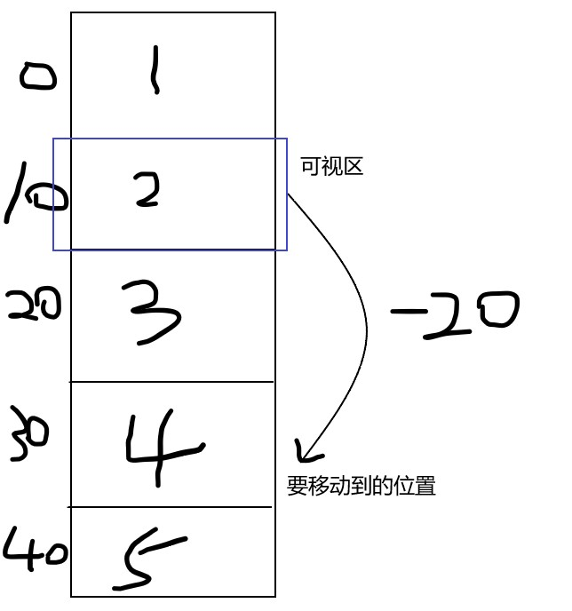

# 全屏滚动

#### 如何使用

	//引入css
	<link rel="stylesheet" href="fullpage.css">
	
	//html，类要相同，fullpage_section的div，不能添加其他class
	

		

			

				

			

			

			

				

			

			

			

		

		

			

		

	

	
	//js
	
	//初始化
	new fullpage({
	   oMain:'.test',
	   speed:20,//帧速度
	   touchDis:30,//触发距离
	   oNext:Array.prototype.slice.call(document.querySelectorAll('.home_nextBtn')),
	   oPrev:Array.prototype.slice.call(document.querySelectorAll('.home_prevBtn'))
	}).init()

#### 参数

实例化时，需要一个对象参数。

	{
		oMain:'.test',//最外层盒子，这个类随意，可以使用id
		speed:20,//帧速度，每帧的速度
		touchDis:30,//触发滚动，移动的距离，当使用鼠标或者touch移动超过这个值时，才滚动
		activeclass:'on',//当前页面的class
		oNext:Array.prototype.slice.call(document.querySelectorAll('.home_nextBtn')),//数组，下一页按钮
		oPrev:Array.prototype.slice.call(document.querySelectorAll('.home_prevBtn'))//数组，上一页按钮
	}

按钮的类随意，不限制。

	

添加`fullpage_paging`在html，实例化后会自动生成按钮。

按钮和当前分页都会有一个特定的`class`，默认是`active`。

#### 原理

> 利用css3的transform进行滚动，计算每屏滚动的距离等等。

#####  应用范围

支持鼠标滑轮滚动，鼠标点击移动触发滚动，移动端touch滚动，分页点击滚动，上下页按钮滚动。

##### 滑轮事件

大部分浏览器都支持`mousewheel`事件的，连ie都支持，但是，火狐不支持，低版本火狐使用的是`DOMMouseScroll`，这里就不说这个了，献上[mdn,mousewheel事件](https://developer.mozilla.org/zh-CN/docs/Web/Events/wheel#浏览器兼容性)（其实我也怎么研究）。

滚轮事件对象有个`deltaY`属性，可以判断滚动的方向的，这样就OK了。

##### 鼠标点击移动触发滚动，移动端touch滚动

这里只要判断`mousedown`的`clientY`和`mouseup`的`clientY`的差值，就能得到要滚动的方向。

	if(lastTouch - firstTouch < -50){
		//向下
	}else if(lastTouch -firstTouch > 50){
		//向上
	}

##### 滚动

这部分就稍微麻烦点，先看看我们要什么东西先：

	moveIndex//要移动的页数，从参数获取到
	index//滚动后的页数位置，从参数获取到
	direction//滚动的方向，从参数获取到
	opts.oldHeight//滚动前，transform的值，从参数获取到
	moveHeight = opts.pageHeight * moveIndex//要移动的距离，pageHeight就是一页的高度
	speedr = null//setInterval对象
	distance = 0//累加的距离（带正负）
	_distance = 0//累加的距离（不带正负）
	_speed = moveHeight / opts.speed //每帧要滚动的距离
	speed = opt.direction === 'down' ? speedNum : -speedNum //带正负的速度
	
	//开始
	var _this = this;
	speedr = setInterval(function(){
		distance += speed;//累积的距离（带正负）
		_distance += speedNum;//累积的距离
		//达到目标值，停止
		if(_distance >= moveHeight){
			//清楚定时器
			clearInterval(speedr);
			//最后达到的距离
			var _dis = (oldHeight + (opt.direction === 'down' ? moveHeight : -moveHeight));
			//直接达到目标值
			_this.addWebkit(opt.el ,  'translateY(' + -_dis +'px)')
			//保存滚动完的距离
			_this.opt.oldHeight = _dis;
		}else{
			//还没达到目标值，继续加
			_this.addWebkit(opt.el , 'translateY(' + -(oldHeight + distance) +'px)')
		}
	}, 16);

上面`setInterval`可以换成`requestAnimationFrame`。

计算出要移动的距离后，每次循环，`distance`就累加`speed`，`_distance`同样也是，因为`_distance`是不带正负的，所以每次就拿`_distance`和`moveHeight`进行比较，如果大于等于，就是已经达到目标地点了，而且其中可能带点小数或超出，这里就要调整一下，变成目标值。如果`_distance`小于`moveHeight`，就是还没达到目标值，就继续累加。

